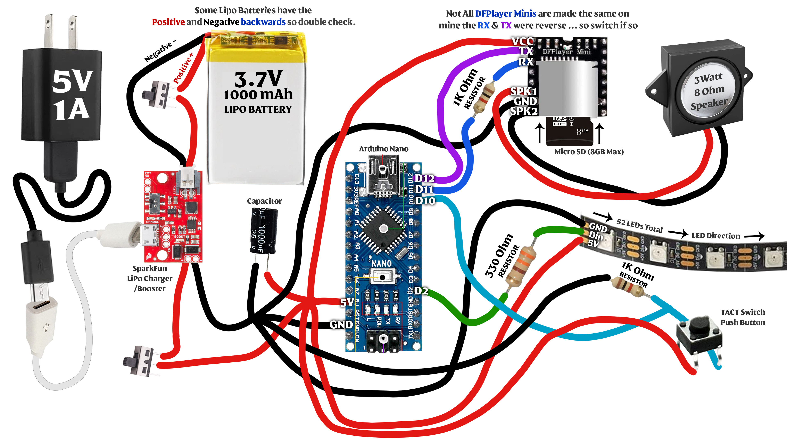

# Sauron Holocron
This is a Lord of the Rings themed Holocron created by Ryan The Cyber Hobbit.

What is a Holocron?  A Holocron is a Star Wars ancient repository of knowledge and wisdom that can only be accessed by those skilled in the Force. In Star Wars, Jedi use them to record and preserve their teachings, creating a record for future generations seeking to understand the mysteries of the Force.

This is a "What if" scenario where we imagine Sauron in the Star Wars universe as a Sith Lord that created a Holocron.

This project was created with the help of this Thingiverse model, I used the "blank" option included: https://www.thingiverse.com/thing:3565057 

### 3D Printing Directions
I printed all the models with a resin printer (Saturn 2).
The printed the STL models at 175% scale. 

### Things I Used
* A Resin or FDM 3D Printer. I used a Saturn 2 (resin).
* Elegoo 405nm Standard Resin Grey 1000g
* Elegoo 405nm Standard Resin Clear Red 500g
* [Arduino Nano](https://www.amazon.com/dp/B07G99NNXL)
* [WS2812B LED Strip 60Pixels/M - 16.4 FT](https://www.amazon.com/dp/B01CDTEJBG)
* [1000mAh Lipo Rechargeable Battery with JST Connector](https://www.amazon.com/dp/B07BTV3W87)
* [SparkFun LiPo Charger/Booster - 5V/1A](https://www.amazon.com/dp/B076953CYL)
* [4 Inch Micro Male to Female USB Extension Cable](https://www.amazon.com/dp/B071NR19BQ)
* [Momentary Tactile Push Button Switch - 12mm x 12mm x 4.3mm](https://www.amazon.com/dp/B07CG6HVY9)
* [Slide Toggle Switches 3 Pin 2 Position - 12.7mm x 6.6mm x 13.2mm (l*w*h)](https://www.amazon.com/dp/B08H5BQ6Y8)
* [1000uf 25V Capacitor](https://www.amazon.com/dp/B06WGPNM19)
* [Micro SD Card 8GB Max](https://www.amazon.com/dp/B085ZVG84C)
* [1K Resistor](https://www.amazon.com/dp/B06WRQS97C)
* [330 ohm Resistor](https://www.amazon.com/dp/B06WRQS97C)
* [Mini MP3 Player - DFPlayer](https://www.amazon.com/dp/B07Y2YKYRS)
* [3 Watt 8 Ohm Speaker](https://www.amazon.com/dp/B07FTB281F)
* Use a breadboard to test everything before you Solder
* Plenty of Solder (70+ connections)
* [Krylon Flat Black Spray Paint](https://www.amazon.com/Krylon-K05546007-COLORmaxx-Spray-Aerosol/dp/B07LFWTW93) 
* [Krylon Flat Clear Coat](https://www.amazon.com/Krylon-K05547007-COLORmaxx-Spray-Aerosol/dp/B07LFWTQNG)
* [Dupli-Color Metal Cast Red](https://www.amazon.com/dp/B000994BUM)
* [Rub 'n Buff - Antique Gold](https://www.amazon.com/dp/B0BC224DPV)
* Sand Paper (320, 600, 1000) grit
* Hot Glue
* Gorilla Super Glue Gel
* [J-B Weld Plastic Bonder](https://www.amazon.com/dp/B01IBOK7FE)

### Arduino Prerequisites
* Some experience with [Arduino](https://www.arduino.cc/)
* Be sure to have the Arduino Nano board installed in your environment.
* Install the [Bounce2](https://github.com/thomasfredericks/Bounce2) library.
* Install the [ButtonEvents](https://github.com/fasteddy516/ButtonEvents) library.
* Install the [DFPlayer Mini Fast](https://github.com/PowerBroker2/DFPlayerMini_Fast) library
If you alter the number of LEDs you use, be sure to change the code "NUM_LEDS" to reflect this.

### Wiring Diagram

### Author
Ryan "The Cyber Hobbit"

